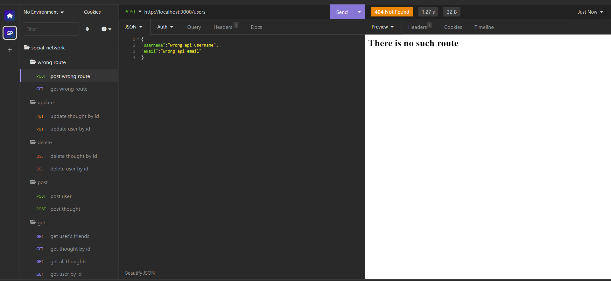
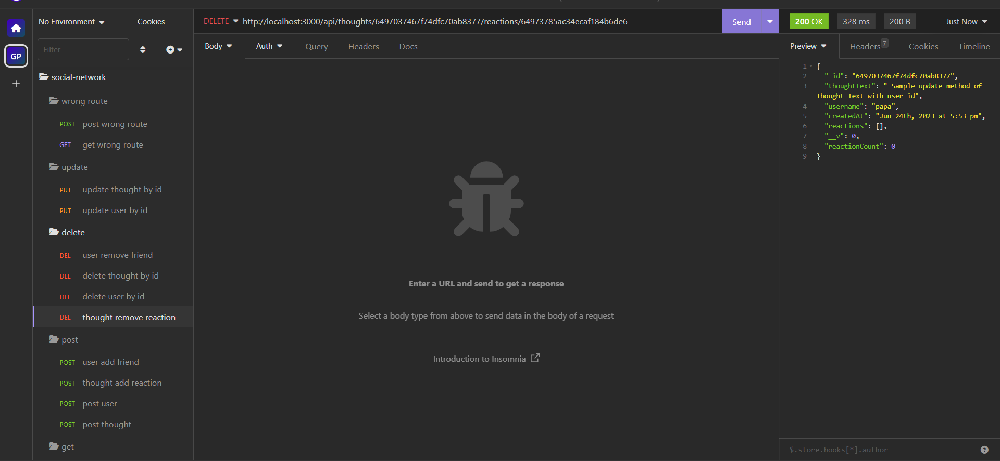

# NoSQL: Social Network API

## Table of Contents

- [Description](#description)
- [Technology](#Technology)
- [Installation](#installation)
- [Usage](#usage)
- [License](#license)
- [Contribution](#contribution)
- [Questions](#questions)

## Description:

It's an API for a social network web application where users can share their thoughts, react to friends’ thoughts, and create a friend list.

## Technology:

This project needs the following technologies:

- Javascript
- Node.js
- Express.js
- MongoDB
- Mongoose

## Installation

To run this project, go to the root directory of the project and install it locally using npm:

```
npm install
```

## Usage

After installing npm packages:

create a local .env file on your root directory and replace those things with your own mongodb url and port number

1. MONGODB_URI ="mongodb+srv://<username>:<password>@cluster0.nhwls.mongodb.net/social-network?retryWrites=true&w=majority" for remote MONGODB
2. PORT= 3000(e.g)
3. or you can use MONGODB_URI= "mongodb://localhost:27017/social-network" if you want to use local MONGODB

```
npm start
```

#### Insomnia screenshotss

Sample wrong route



Sample post users route


Sample get user by id route


Sample get all users route


Sample post thoughts route


Sample get all thoughts route


Sample get thought by id route


Sample update user with id route


Sample update thought with id route


sample post reaction for specific thought route


sample remove reaction for specific thought route



sample post add friend for specific user route


sample remove friend for specific user route


## License

[](https://opensource.org/licenses/MIT)
This project is licensed under MIT.
for more information please visit [this website](https://opensource.org/licenses/MIT)

## Contribution

Made by Abel Zemo 

## Questions?

Please feel free to contact me if you need any further information:

- [Email](abelzemo@gmail.com)
- [Github Profile](https://github.com/AbelZemo)

#### Walkthrough Video

[Click me to see the demo video!]("")

